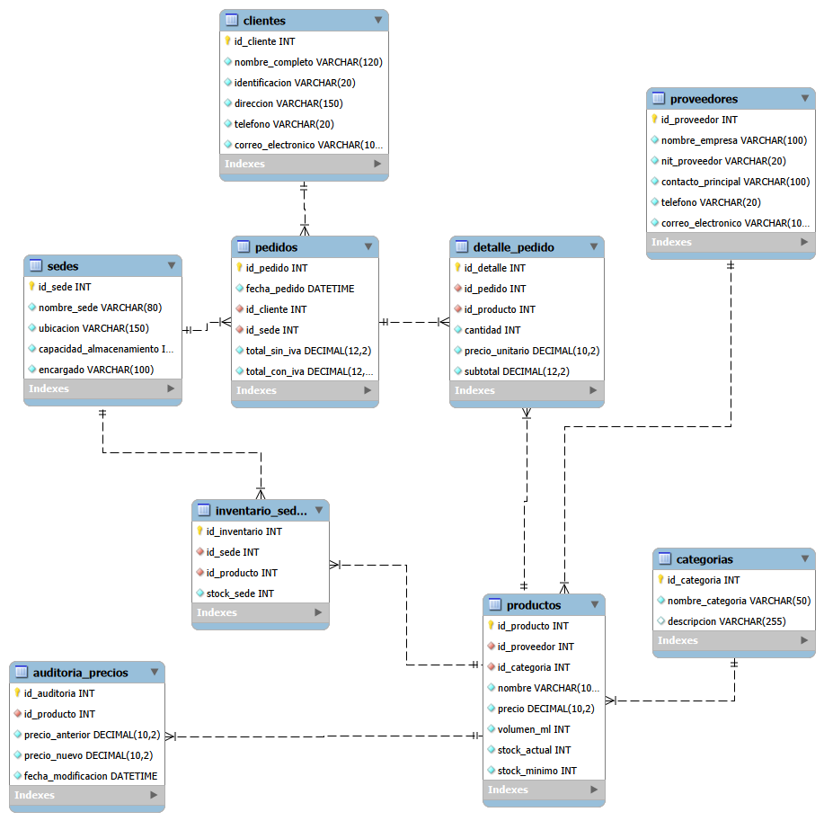

# Distribuidora del Valle S.A. - Sistema de Gestión de Inventario y Ventas

Sistema de gestión de base de datos relacional para el control de inventario, gestión de pedidos, clientes y administración de múltiples sedes para Distribuidora del Valle S.A.

---

## Autor

* Sergio Ricardo Ajú Miranda - Diseño y desarrollo de la base de datos

---

## Descripción del Proyecto

Este proyecto implementa una base de datos relacional completamente normalizada en MySQL para optimizar la logística y comercialización de bebidas. Permite gestionar de forma centralizada la disponibilidad de stock por sucursal, el registro detallado de ventas con cálculo de impuestos y la relación con los clientes.

---



## Estructura de la Base de Datos

El modelo relacional está compuesto por las siguientes tablas principales:

* **clientes**: Información de contacto y registros de identificación de compradores.
* **categorias**: Clasificación de productos (gaseosas, jugos, aguas, etc.) y presentación de volumen.
* **encargados**: Datos del personal responsable de la supervisión de sedes.
* **productos**: Catálogo de bebidas registradas con precios base unitarios.
* **sedes**: Ubicaciones físicas de las sucursales y sus respectivos encargados.
* **stocks**: Control dinámico de inventario por sede (stock actual, mínimo y capacidad máxima).
* **pedidos**: Histórico de transacciones de venta, montos netos y totales calculados con IVA.
* **detalle_pedidos**: Desglose ítem por ítem de cada producto vendido dentro de un pedido.

---

## Requisitos Previos

* MySQL Server (versión 8.0 o superior recomendada)
* MySQL Workbench o cualquier cliente SQL compatible

---

## Instrucciones de Instalación y Ejecución

1. Clonar el repositorio:
   ```bash
   git clone [https://github.com/tu-usuario/delvalle-distribuidora.git](https://github.com/tu-usuario/delvalle-distribuidora.git)
   cd delvalle-distribuidora